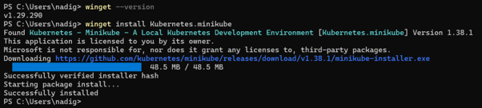
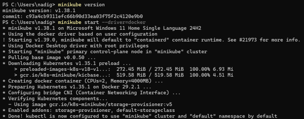
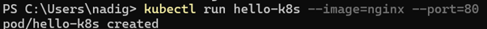
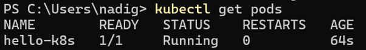
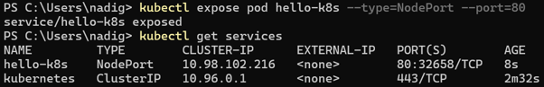
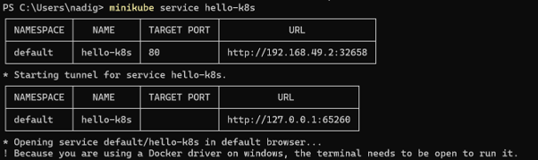
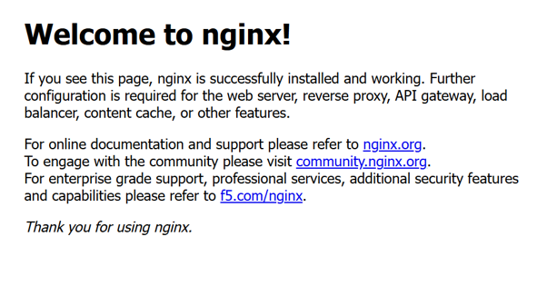
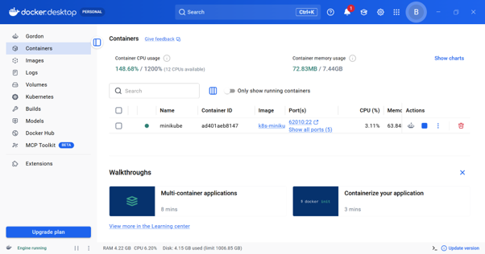
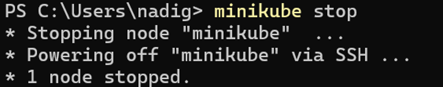
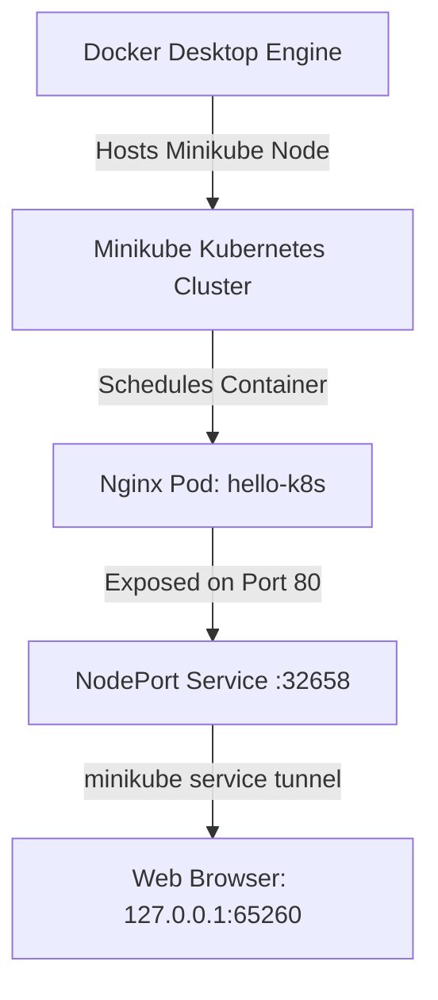

# Kubernetes Hands-On Exercise Series

## Exercise 1: Hello Pod

### 🎯 Objective

The objective of this exercise is to deploy a simple Nginx application on a local Kubernetes cluster using Minikube. This exercise demonstrates the complete end-to-end workflow: installing Minikube, starting a local single-node cluster using the Docker driver, deploying a container inside a Kubernetes Pod, exposing it externally using a NodePort Service, accessing the live web application in a browser, verifying container workloads in Docker Desktop, and gracefully shutting down the cluster.

---

## 🛠️ Prerequisites & Setup

The following tools and environment were configured:

- **Windows PowerShell** (Terminal environment)
- **Windows Package Manager (`winget`)**
- **Docker Desktop** (Container engine & virtualization driver)
- **Minikube** (Local Kubernetes cluster manager)
- **kubectl** (Kubernetes command-line interface)

---

## 📋 Step-by-Step Implementation

### Step 1: Install Minikube via Winget

Minikube was installed using the Windows Package Manager (`winget`):

```powershell
# Check winget version and install Minikube
winget --version
winget install Kubernetes.minikube
```

**Output:**
```text
v1.29.290
Found Kubernetes - Minikube - A Local Kubernetes Development Environment [Kubernetes.minikube] Version 1.38.1
Downloading https://github.com/kubernetes/minikube/releases/download/v1.38.1/minikube-installer.exe
Successfully verified installer hash
Starting package install...
Successfully installed
```

**Screenshot:**


---

### Step 2: Verify Minikube & Start Cluster with Docker Driver

The Minikube installation was verified and a local single-node Kubernetes cluster was started using Docker Desktop as the driver:

```powershell
# Verify version and start local cluster
minikube version
minikube start --driver=docker
```

**Output:**
```text
minikube version: v1.38.1
commit: c93a4cb9311efc66b90d33ea03f75f2c4120e9b0

* minikube v1.38.1 on Microsoft Windows 11 Home Single Language 24H2
* Using the docker driver based on user configuration
! Starting v1.39.0, minikube will default to "containerd" container runtime. See #21973 for more info.
* Using Docker Desktop driver with root privileges
* Starting "minikube" primary control-plane node in "minikube" cluster
* Pulling base image v0.0.50 ...
* Downloading Kubernetes v1.35.1 preload ...
* Creating docker container (CPUs=2, Memory=4000MB) ...
* Preparing Kubernetes v1.35.1 on Docker 29.2.1 ...
* Configuring bridge CNI (Container Networking Interface) ...
* Verifying Kubernetes components...
  - Using image gcr.io/k8s-minikube/storage-provisioner:v5
* Enabled addons: storage-provisioner, default-storageclass
* Done! kubectl is now configured to use "minikube" cluster and "default" namespace by default
```

**Screenshot:**


---

### Step 3: Create an Nginx Pod

An Nginx web server container was deployed as a Kubernetes Pod named `hello-k8s`:

```powershell
kubectl run hello-k8s --image=nginx --port=80
```

**Output:**
```text
pod/hello-k8s created
```

**Screenshot:**


---

### Step 4: Verify Pod Status

The status of the Pod was checked to confirm that it transitioned into the `Running` state:

```powershell
kubectl get pods
```

**Output:**
```text
NAME        READY   STATUS    RESTARTS   AGE
hello-k8s   1/1     Running   0          64s
```

**Screenshot:**


---

### Step 5: Expose the Pod as a NodePort Service

The Nginx Pod was exposed to external network traffic by creating a `NodePort` Service on port 80, and the assigned port mappings were inspected:

```powershell
# Expose Pod and verify Service
kubectl expose pod hello-k8s --type=NodePort --port=80
kubectl get services
```

**Output:**
```text
service/hello-k8s exposed

NAME         TYPE        CLUSTER-IP       EXTERNAL-IP   PORT(S)        AGE
hello-k8s    NodePort    10.98.102.216    <none>        80:32658/TCP   8s
kubernetes   ClusterIP   10.96.0.1        <none>        443/TCP        2m32s
```

**Screenshot:**


---

### Step 6: Create Network Tunnel & Access Application

Because Minikube is running with the Docker driver on Windows, the `minikube service` command was executed to start a network tunnel and resolve the external port forwarding:

```powershell
minikube service hello-k8s
```

**Output:**
```text
|-----------|-----------|-------------|-----------------------------|
| NAMESPACE |   NAME    | TARGET PORT |             URL             |
|-----------|-----------|-------------|-----------------------------|
| default   | hello-k8s |          80 | http://192.168.49.2:32658   |
|-----------|-----------|-------------|-----------------------------|
* Starting tunnel for service hello-k8s.
|-----------|-----------|-------------|-----------------------------|
| NAMESPACE |   NAME    | TARGET PORT |             URL             |
|-----------|-----------|-------------|-----------------------------|
| default   | hello-k8s |             | http://127.0.0.1:65260      |
|-----------|-----------|-------------|-----------------------------|
* Opening service default/hello-k8s in default browser...
! Because you are using a Docker driver on windows, the terminal needs to be open to run it.
```

**Screenshot (Terminal Tunnel):**


---

### Step 7: Access the Web Application in Browser

The tunnel launched the default browser displaying the live Nginx landing page:

```text
Welcome to nginx!
```

**Screenshot (Browser Output):**


---

### Step 8: Docker Desktop Runtime Verification

The underlying container environment was inspected in Docker Desktop. The dashboard confirmed:
1. Docker Engine is active (**Engine running**).
2. The `minikube` container node is healthy, active, and managing the Kubernetes workloads.

**Screenshot:**


---

### Step 9: Stop the Minikube Cluster

After validating the application and completing the exercise, the Minikube cluster was gracefully shut down to release system CPU and memory resources:

```powershell
minikube stop
```

**Output:**
```text
* Stopping node "minikube" ...
* Powering off "minikube" via SSH ...
* 1 node stopped.
```

**Screenshot:**


---

## 🏗️ Architecture Overview



### Flow Representation

```text
+-------------------------------------------------------+
|                    Docker Desktop                     |
|                (Engine Running / Driver)              |
+---------------------------+---------------------------+
                            |
                            v
+-------------------------------------------------------+
|              Minikube Kubernetes Cluster              |
+---------------------------+---------------------------+
                            |
                            v
+-------------------------------------------------------+
|                 Nginx Pod (hello-k8s)                 |
|                   (Port 80 / Running)                 |
+---------------------------+---------------------------+
                            |
                            v
+-------------------------------------------------------+
|                    NodePort Service                   |
|                   (Port: 80:32658/TCP)                |
+---------------------------+---------------------------+
                            |
                            v
+-------------------------------------------------------+
|             Minikube Service Tunnel Proxy             |
|                 (http://127.0.0.1:65260)              |
+---------------------------+---------------------------+
                            |
                            v
+-------------------------------------------------------+
|                   Web Browser Client                  |
|                 ("Welcome to nginx!")                 |
+-------------------------------------------------------+
```

---

## 💻 Commands Summary

| # | Command | Purpose |
|---|---------|---------|
| 1 | `winget install Kubernetes.minikube` | Install Minikube CLI via Windows Package Manager |
| 2 | `minikube version` | Check Minikube CLI version |
| 3 | `minikube start --driver=docker` | Initialize local Kubernetes cluster with Docker driver |
| 4 | `kubectl run hello-k8s --image=nginx --port=80` | Create and run a new Nginx pod |
| 5 | `kubectl get pods` | View pod status and health |
| 6 | `kubectl expose pod hello-k8s --type=NodePort --port=80` | Expose the pod via a NodePort service |
| 7 | `kubectl get services` | List all active services and port mappings |
| 8 | `minikube service hello-k8s` | Create a network tunnel and open the service in the browser |
| 9 | `minikube stop` | Gracefully shut down the Minikube cluster |

---

## 💡 Key Learnings

1. **Package Management**: Installed and managed Kubernetes developer tooling using `winget`.
2. **Local Cluster Orchestration**: Configured and initialized a local single-node Kubernetes cluster using Minikube powered by the Docker driver.
3. **Workload Management**: Scheduled, managed, and monitored an Nginx container inside a Kubernetes Pod using `kubectl`.
4. **Service Networking & Ingress**: Understood Kubernetes networking fundamentals by creating a `NodePort` Service to expose container ports.
5. **Docker Networking on Windows**: Handled Windows container networking constraints using `minikube service` to create a loopback tunnel proxy.
6. **Container & Node Inspection**: Verified running workloads directly inside the Docker Desktop GUI.
7. **Resource Lifecycle Management**: Safely stopped cluster nodes using `minikube stop` after completing testing.

---

## 📸 Screenshots Index

All screenshots captured during this exercise are cataloged below:

| File | Step | Description |
|---|---|---|
| [`01-install-minikube.png`](./screenshots/01-install-minikube.png) | Step 1 | Winget Minikube installation |
| [`02-minikube-start.png`](./screenshots/02-minikube-start.png) | Step 2 | Minikube version & cluster startup |
| [`03-create-pod.png`](./screenshots/03-create-pod.png) | Step 3 | `kubectl run hello-k8s` pod creation |
| [`04-pod-running.png`](./screenshots/04-pod-running.png) | Step 4 | `kubectl get pods` showing Running status |
| [`05-expose-service.png`](./screenshots/05-expose-service.png) | Step 5 | Exposing NodePort service & `kubectl get services` |
| [`06-minikube-service-tunnel.png`](./screenshots/06-minikube-service-tunnel.png) | Step 6 | `minikube service` port-forward tunnel |
| [`07-nginx-browser.png`](./screenshots/07-nginx-browser.png) | Step 7 | Browser showing "Welcome to nginx!" |
| [`08-docker-desktop.png`](./screenshots/08-docker-desktop.png) | Step 8 | Docker Desktop showing Engine running & Minikube container |
| [`09-minikube-stop.png`](./screenshots/09-minikube-stop.png) | Step 9 | `minikube stop` cluster shutdown |
