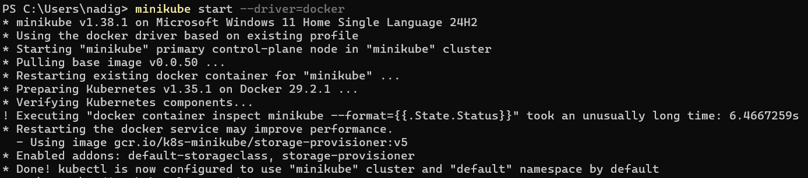
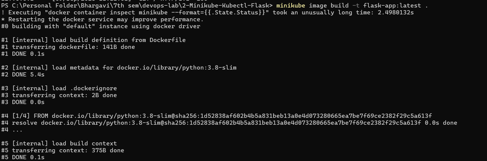
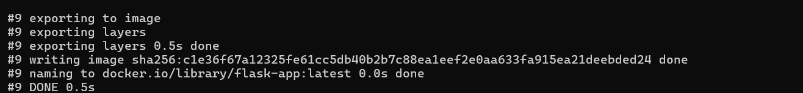
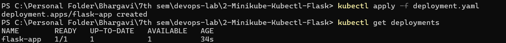
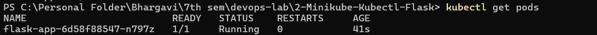
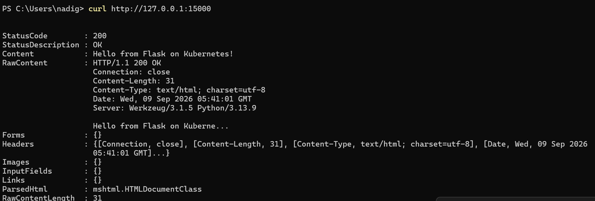
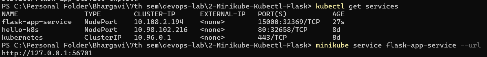
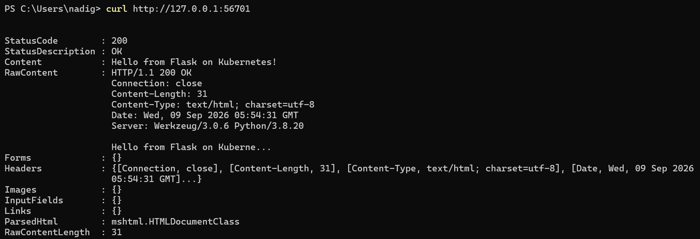

# Exercise 2: Deploy a Flask Application on Minikube using kubectl and YAML

## Objective

To deploy a Flask application on a local Kubernetes cluster using Minikube and `kubectl`, and expose the application using a NodePort Service.

---

## Prerequisites

- Docker Desktop
- Minikube
- kubectl
- Python
- Flask
- A working Kubernetes cluster

---

## 1. Start Minikube

Start the Minikube cluster using the Docker driver:

```powershell
minikube start --driver=docker
```

Verify that the node is running:

```powershell
kubectl get nodes
```

The node should be in the `Ready` state.



---

## 2. Create the Flask Application

Create an `app.py` file with the following content:

```python
from flask import Flask

app = Flask(__name__)

@app.route('/')
def home():
    return "Hello from Flask on Kubernetes!"

if __name__ == '__main__':
    app.run(host='0.0.0.0', port=15000)
```

This Flask application:

- Runs on port `15000`
- Listens on `0.0.0.0`
- Returns `Hello from Flask on Kubernetes!`

Test it locally before deploying to Kubernetes:

```powershell
curl http://127.0.0.1:15000
```

The output should return the message successfully.



---

## 3. Create the Docker Image

Create a `Dockerfile`:

```dockerfile
FROM python:3.8-slim

WORKDIR /app

COPY . /app

RUN pip install flask

CMD ["python", "app.py"]
```

Build the Docker image inside Minikube:

```powershell
minikube image build -t flask-app:latest .
```

The image name is:

```text
flask-app:latest
```



---

## 4. Create the Kubernetes Deployment

Create a file named `deployment.yaml`:

```yaml
apiVersion: apps/v1
kind: Deployment
metadata:
  name: flask-app
spec:
  replicas: 1
  selector:
    matchLabels:
      app: flask-app
  template:
    metadata:
      labels:
        app: flask-app
    spec:
      containers:
        - name: flask-app
          image: flask-app:latest
          imagePullPolicy: Never
          ports:
            - containerPort: 15000
```

### Important points

- `replicas: 1` keeps one pod running.
- `image: flask-app:latest` refers to the Docker image.
- `containerPort: 15000` matches the Flask app port.
- `imagePullPolicy: Never` tells Kubernetes to use the image already available in Minikube.



---

## 5. Deploy the Application

Apply the Deployment YAML:

```powershell
kubectl apply -f deployment.yaml
```

Check the deployment:

```powershell
kubectl get deployments
```

Expected output:

```text
NAME        READY   UP-TO-DATE   AVAILABLE
flask-app   1/1     1            1
```

---

## 6. Check the Flask Pod

Check the running Pods:

```powershell
kubectl get pods
```

The flask pod should show `1/1` and `Running`.

The Deployment creates and manages the Pod that runs the Flask container.

```text
Deployment
     ↓
ReplicaSet
     ↓
Pod
     ↓
Container
     ↓
Flask Application
```



---

## 7. Verify the Deployment Details

Inspect the Deployment for more information:

```powershell
kubectl describe deployment flask-app
```

This command displays details such as:

- Deployment name
- Number of replicas
- Container image
- Container port
- ReplicaSet
- Deployment status



---

## 8. Expose the Flask Application using a Service

Create a NodePort Service to expose the application:

```powershell
kubectl expose deployment flask-app --type=NodePort --port=15000 --target-port=15000 --name=flask-app-service
```

Check the services:

```powershell
kubectl get services
```

The output should include a service similar to:

```text
flask-app-service   NodePort   ...   15000:32369/TCP
```

Here:

- `15000` = Service port
- `32369` = NodePort
- `15000` = Target port of the Flask application



---

## 9. Access the Flask Application

Generate the local URL through Minikube:

```powershell
minikube service flask-app-service --url
```

This may return an address like:

```text
http://127.0.0.1:56701
```

Access the application from the terminal:

```powershell
curl http://127.0.0.1:56701
```

Expected output:

```text
Hello from Flask on Kubernetes!
```



---

## Port Flow

The application uses several ports during deployment:

```text
Flask Application
      │
      │ Port 15000
      ↓
Container
      │
      │ Target Port 15000
      ↓
Kubernetes Service
      │
      │ Service Port 15000
      ↓
NodePort 32369
      │
      ↓
Minikube
      │
      │ Local forwarding
      ↓
127.0.0.1:56701
```

### Port Summary

| Port  | Purpose                                         |
| ----- | ----------------------------------------------- |
| 15000 | Flask application port                          |
| 15000 | Container / target port                         |
| 15000 | Kubernetes Service port                         |
| 32369 | NodePort assigned by Kubernetes                 |
| 56701 | Local port provided by `minikube service --url` |

---

## Result

The Flask application was successfully:

1. Created using Flask.
2. Packaged into a Docker image.
3. Deployed as a Kubernetes Deployment on Minikube.
4. Run inside a Kubernetes Pod.
5. Exposed using a NodePort Service.
6. Accessed successfully via the Minikube-generated local URL.

### Final Output

```text
Hello from Flask on Kubernetes!
```

The Flask application was successfully deployed and accessed through Kubernetes using Minikube.
