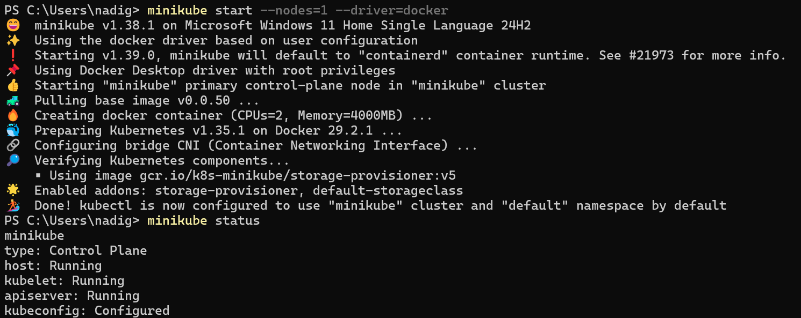
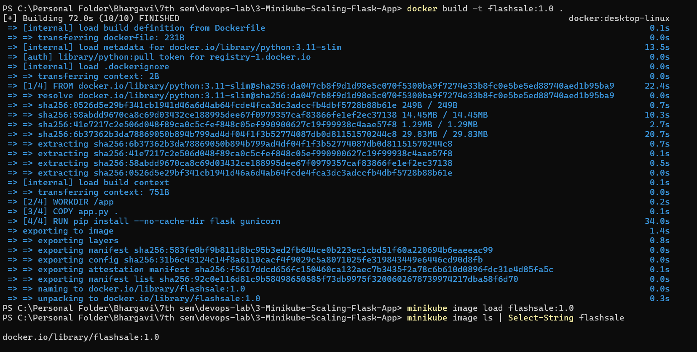
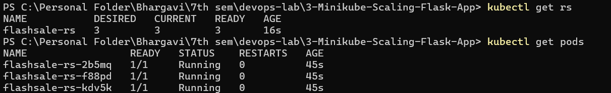
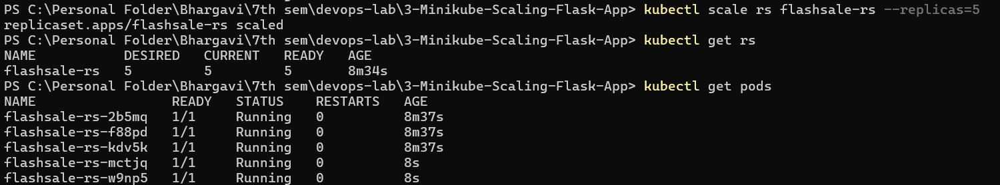
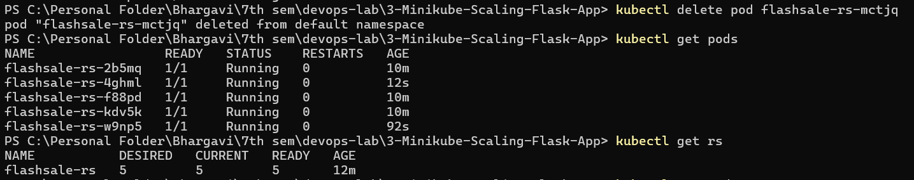
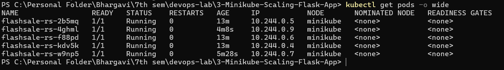

# Scaling Flask App on a Single Node Using ReplicaSets

## Objective

- Understand Kubernetes ReplicaSets and Pods.
- Scale a Flask application using a ReplicaSet.
- Observe Pod creation, scaling, self-healing, and Pod distribution on a single node.

## Technologies Used

- Python
- Flask
- Docker
- Kubernetes
- Minikube
- kubectl
- Docker Desktop

---

## Project Structure

```text
3-Minikube-Scaling-Flask-App/
│
├── app.py
├── Dockerfile
├── flashsale-replicaset.yaml
└── README.md
```

---

# 1. Create the Flask Application

Create a file named `app.py`.

```python
from flask import Flask, request
import socket, time, random

app = Flask(__name__)

@app.get("/")
def homepage():
    return {
        "message": "Welcome to Big Sale!",
        "pod": socket.gethostname(),
        "ts": time.time()
    }

@app.get("/buy")
def buy():
    item = random.choice(["Smartphone", "Shoes", "Headphones", "Laptop"])
    user = request.args.get("user", f"user{random.randint(1,1000)}")
    return {
        "status": "success",
        "item": item,
        "user": user,
        "served_by_pod": socket.gethostname(),
        "time": time.strftime("%H:%M:%S")
    }

@app.get("/health")
def health():
    return {"status": "healthy", "pod": socket.gethostname()}
```

The `/health` endpoint is used by Kubernetes for readiness and liveness probes.

---

# 2. Create the Dockerfile

Create a file named `Dockerfile`.

```dockerfile
FROM python:3.11-slim

WORKDIR /app

COPY app.py .

RUN pip install --no-cache-dir flask gunicorn

CMD ["gunicorn", "-b", "0.0.0.0:5000", "app:app", "--workers", "1", "--threads", "2"]
```

---

# 3. Start Docker Desktop

Make sure Docker Desktop is running and Docker Engine is active before starting Minikube.

This project uses the Docker driver for Minikube.

---

# 4. Start Minikube with a Single Node

If an old Minikube cluster exists, it can be removed first:

```powershell
minikube stop
minikube delete
```

Start a new single-node cluster:

```powershell
minikube start --nodes=1 --driver=docker
```

Verify the Minikube status:

```powershell
minikube status
```

Verify the Kubernetes node:

```powershell
kubectl get nodes
```

Expected result:

```text
NAME       STATUS   ROLES           ...
minikube   Ready    control-plane   ...
```

> Note: On Windows with Docker Desktop, the `--driver=docker` option is used explicitly.



_Caption: Minikube single-node cluster successfully started_

---

# 5. Build the Docker Image

Build the image using Docker Desktop:

```powershell
docker build -t flashsale:1.0 .
```

Verify that the image was created:

```powershell
docker images
```

The image should be listed as:

```text
flashsale   1.0
```

---

# 6. Load the Image into Minikube

Load the Docker image into the Minikube environment:

```powershell
minikube image load flashsale:1.0
```

Verify that Minikube has the image:

```powershell
minikube image ls | Select-String flashsale
```

Expected:

```text
docker.io/library/flashsale:1.0
```

> Why this step is important: The image was built in Docker Desktop, while the Kubernetes Pods run inside Minikube. Loading the image makes `flashsale:1.0` available to the Minikube cluster without requiring it to be pulled from Docker Hub.



_Caption: Docker image built and loaded into Minikube_

---

# 7. Create the ReplicaSet Configuration

Create a file named:

```text
flashsale-replicaset.yaml
```

Add the following configuration:

```yaml
apiVersion: apps/v1
kind: ReplicaSet
metadata:
  name: flashsale-rs
  labels:
    app: flashsale

spec:
  replicas: 3

  selector:
    matchLabels:
      app: flashsale

  template:
    metadata:
      labels:
        app: flashsale

    spec:
      containers:
        - name: flashsale-container
          image: flashsale:1.0
          imagePullPolicy: Never

          ports:
            - containerPort: 5000

          readinessProbe:
            httpGet:
              path: /health
              port: 5000
            initialDelaySeconds: 2
            periodSeconds: 5

          livenessProbe:
            httpGet:
              path: /health
              port: 5000
            initialDelaySeconds: 10
            periodSeconds: 10

          resources:
            requests:
              cpu: "100m"
              memory: "128Mi"
            limits:
              cpu: "500m"
              memory: "256Mi"

---
apiVersion: v1
kind: Service
metadata:
  name: flashsale-svc

spec:
  selector:
    app: flashsale

  ports:
    - name: http
      port: 80
      targetPort: 5000

  type: ClusterIP
```

### Important

The ReplicaSet starts with:

```yaml
replicas: 3
```

and uses:

```yaml
imagePullPolicy: Never
```

because the `flashsale:1.0` image has already been loaded into Minikube.

---

# 8. Apply the Configuration

Run:

```powershell
kubectl apply -f flashsale-replicaset.yaml
```

Expected:

```text
replicaset.apps/flashsale-rs created
service/flashsale-svc created
```

---

# 9. Verify the ReplicaSet

Run:

```powershell
kubectl get rs
```

Expected:

```text
NAME           DESIRED   CURRENT   READY
flashsale-rs   3         3         3
```

This confirms that the ReplicaSet has created and maintained three ready Pods.



_Caption: ReplicaSet running with 3 healthy Pods_

---

# 10. Verify the Pods

Run:

```powershell
kubectl get pods
```

Expected:

```text
NAME                 READY   STATUS    RESTARTS
flashsale-rs-xxxxx   1/1     Running   0
flashsale-rs-yyyyy   1/1     Running   0
flashsale-rs-zzzzz   1/1     Running   0
```

The Pod names will be different on every run.

---

# 11. Scale the ReplicaSet to 5 Pods

Run:

```powershell
kubectl scale rs flashsale-rs --replicas=5
```

Expected:

```text
replicaset.apps/flashsale-rs scaled
```

Verify:

```powershell
kubectl get rs
```

Expected:

```text
NAME           DESIRED   CURRENT   READY
flashsale-rs   5         5         5
```

---

# 12. Verify the 5 Pods

Run:

```powershell
kubectl get pods
```

There should now be five Pods, all in the `Running` state and showing `1/1` under `READY`.



_Caption: ReplicaSet scaled from 3 to 5 Pods_

---

# 13. Test ReplicaSet Self-Healing

Delete one of the running Pods.

For example:

```powershell
kubectl delete pod <pod-name>
```

Example:

```powershell
kubectl delete pod flashsale-rs-xxxxx
```

Expected:

```text
pod "flashsale-rs-xxxxx" deleted
```

Now check the Pods:

```powershell
kubectl get pods
```

A new Pod with a different name should appear.

Verify the ReplicaSet:

```powershell
kubectl get rs
```

Expected:

```text
NAME           DESIRED   CURRENT   READY
flashsale-rs   5         5         5
```

### Observation

Even after manually deleting one Pod, the ReplicaSet creates a replacement Pod to maintain the desired count of five Pods.

This demonstrates the self-healing behavior of a ReplicaSet.



_Caption: ReplicaSet automatically creates a replacement Pod after deletion_

---

# 14. View Pod Distribution

Run:

```powershell
kubectl get pods -o wide
```

This displays additional information including:

- Pod IP address
- Node on which each Pod is running

Since this exercise uses a single-node Minikube cluster, all five Pods should show:

```text
NODE
minikube
```

Example:

```text
NAME                 READY   STATUS    IP           NODE
flashsale-rs-xxxxx   1/1     Running   10.244.0.x   minikube
flashsale-rs-yyyyy   1/1     Running   10.244.0.x   minikube
flashsale-rs-zzzzz   1/1     Running   10.244.0.x   minikube
...
```



_Caption: Five Pods running on the single Minikube node_

---

# 15. Final Result

The Flask application was successfully deployed using a Kubernetes ReplicaSet on a single-node Minikube cluster.

The experiment demonstrated:

- Creation of multiple identical Pods using a ReplicaSet.
- Scaling from 3 Pods to 5 Pods.
- Automatic replacement of a deleted Pod.
- Maintenance of the desired number of replicas.
- Distribution of multiple Pods across a single Kubernetes node.

## Key Learnings

### ReplicaSet

A ReplicaSet maintains a specified number of identical Pod replicas.

### Scaling

Changing the replica count from 3 to 5 causes Kubernetes to create additional Pods.

### Self-Healing

When a managed Pod is deleted, the ReplicaSet automatically creates a replacement.

### Single-Node Deployment

Multiple Pods can run on the same Kubernetes node. In this experiment, all five Pods run on the `minikube` node.

---

## Summary

This lab shows how Kubernetes manages application availability and scaling using a ReplicaSet on a single Minikube node. The Key outcomes are:

- 3 initial Pods running
- ReplicaSet scaled to 5 Pods
- Deleted Pod automatically replaced
- All Pods scheduled on the same `minikube` node

This demonstrates the practical benefits of declarative scaling and self-healing in Kubernetes.
